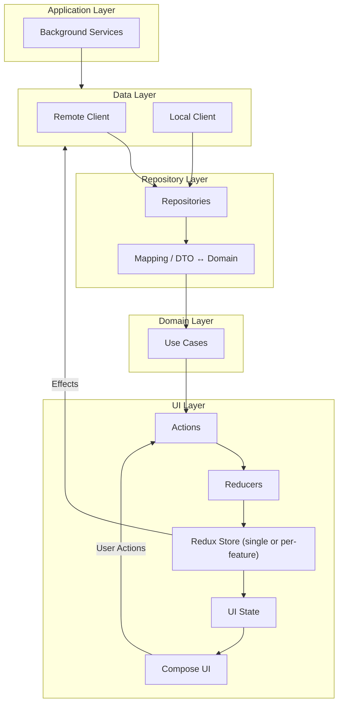

# Bluebell 🌸

*A Kotlin Multiplatform SDK and project template inspired by the bluebell flower  
(*Hyacinthoides non-scripta*) — elegant, minimal, and built to grow where it’s planted.*

---

## Overview

**Bluebell** is an SDK and template for **Kotlin Multiplatform Mobile (KMM)** projects.  
It provides a modular, opinionated foundation for building cross-platform apps with strict data flow rules, consistent architecture, and optional components you can selectively adopt.

The project is split into two repositories:

- **Public Repository**: Documentation, website, and CI/CD workflows.  
- **Private Repository**: Core SDK code, distributed as an asset to customers.  

---

## Goals

- **Minimal by Design**: Use only what you need, no heavy dependencies.  
- **Strict Data Flow**: Predictable state and unidirectional flow across layers.  
- **Composable Features**: Self-sustained and consistent module layout.  
- **Cross-Platform First**: Shared logic with platform-specific integrations where required.  

---

## Architecture

Bluebell enforces **clear boundaries** across architectural layers with predictable, unidirectional data flow.  

The **Redux store** can be configured as:  
- A **single global application state**, or  
- **Flux-like stores per feature**, each with their own dispatcher that can subscribe to actions from other features.  

---

### Unified Architecture Diagram

