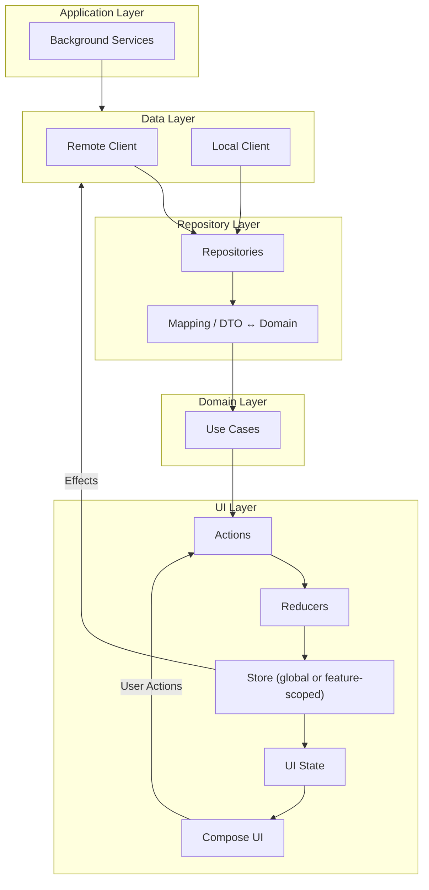

# Bluebell

[](https://kotlinlang.org/)
[](https://www.jetbrains.com/kotlin-multiplatform/)
[](#supported-targets)
[](./sdk/LICENSE)

Kotlin Multiplatform SDK and template for building strongly-structured, cross-platform applications.

## Why This Project Exists

Cross-platform teams often end up with inconsistent data flow, mixed responsibilities, and platform drift over time.
Bluebell exists to provide:

- A predictable unidirectional architecture for state 
- A predictable bi-directional architecture for external data
- A shared, modular foundation across Android, iOS, JVM, and Linux targets.
- Declarative UI first across all platforms
- AI enabled and model-ready workflows
- A practical starting point for teams that want clear boundaries without heavy framework lock-in.

## Overview

Bluebell is a Kotlin Multiplatform SDK with reusable architecture and UI primitives, plus a companion module for experimentation and target scaffolding.

## Project Structure

| Path | Purpose |
| --- | --- |
| `sdk/library` | Main published SDK module (`com.micrantha.bluebell:library`) |
| `sdk/krux` | Secondary KMP module used for additional target and test setup |
| `sdk/buildSrc` | Shared Gradle convention/plugin code |
| `docs/` | Documentation workspace |

## Supported Targets

Current configured targets across modules include:

- JVM
- Android
- iOS (`iosX64`, `iosArm64`, `iosSimulatorArm64`)
- Linux (`linuxX64`)

## Quick Start

From the repository root:

```bash
cd sdk
./gradlew build
./gradlew check
```

Build individual modules:

```bash
./gradlew :library:build
./gradlew :krux:build
```

Publish locally for integration testing:

```bash
./gradlew :library:publishToMavenLocal
```

## Installation

Once published locally, consume from another project with:

```kotlin
dependencies {
    implementation("com.micrantha.bluebell:library:0.1.0")
}
```

## Architecture

Bluebell enforces clear boundaries and unidirectional data flow.
State can be modeled as either:

- A single global application state.
- Feature-scoped Flux-style stores with dispatchers.


```mermaid
flowchart TD
    subgraph App["Application Layer"]
        Services["Background Services"]
    end

    subgraph Data["Data Layer"]
        Remote["Remote Client"]
        Local["Local Client"]
    end

    subgraph Repo["Repository Layer"]
        RepoStore["Repositories"]
        Mapping["Mapping / DTO ↔ Domain"]
    end

    subgraph Domain["Domain Layer"]
        UseCases["Use Cases"]
    end

    subgraph UI["UI Layer"]
        Actions["Actions"]
        Reducer["Reducers"]
        Redux["Store (global or feature-scoped)"]
        UIState["UI State"]
        Compose["Compose UI"]
    end

    Remote --> RepoStore
    Local --> RepoStore
    RepoStore --> Mapping --> UseCases --> Actions
    Actions --> Reducer --> Redux --> UIState --> Compose

    Compose -->|User Actions| Actions
    Redux -->|Effects| Data
    Services --> Data
```

## Publishing

- Local publishing: `./gradlew :library:publishToMavenLocal`
- Maven Central publishing: `./gradlew :library:publishToMavenCentral`
- Additional notes: [`sdk/PUBLISH.md`](./sdk/PUBLISH.md)

## Contributing

See contributor workflow and standards in [`AGENTS.md`](./AGENTS.md). At minimum, run:

```bash
cd sdk
./gradlew check
```

## License

See [`LICENSE`](./LICENSE).
